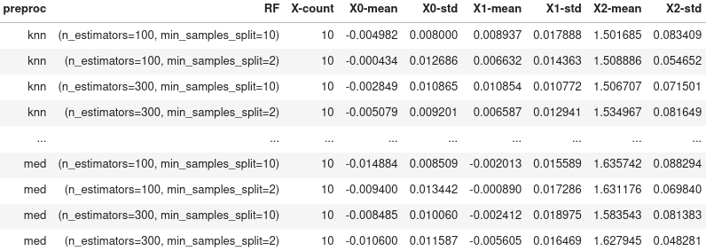

# Summary

`VeridicalFlow` is a Python package that simplifies building reproducible and trustworthy data science pipelines using the PCS (predictability-computability-stability) framework [@yu2020veridical].
It provides users with a simple interface for stability analysis, i.e. checking the robustness of results from a data science pipeline to various judgement calls made during modeling.
This ensures that arbitrary judgement calls made by data practitioners (e.g. specifying a default imputation strategy) do not dramatically alter the final conclusions made in a modeling pipeline.
In addition to wrappers facilitating stability analysis, `VeridicalFlow` also automates many cumbersome coding aspects of Python pipelines, including experiment tracking and saving, parallelization, and caching, all through integrations with existing Python packages.
Overall, the package helps to code using the PCS framework, by screening models for predictive performance, helping automate computation, and facilitating stability analysis.

# Statement of need

Predictability, computability, and stability are central concerns in modern statistical/machine learning practice, as they are required to help vet that findings reflect reality, can be reasonably computed, and are robust as the many judgment calls during the data science life cycle which often go unchecked [@yu2020veridical]. 

The package focuses on stability but also provides wrappers to help support and improve predictability and computability.
Stability is a common-sense principle related to notions of scientific reproducibility [@ivie2018reproducibility], sample variability, robust statistics, sensitivity analysis [@saltelli2002sensitivity], and stability in numerical analysis and control theory.
Moreover, stability serves as a prerequisite for understanding which parts of a model will generalize and can be interpreted [@murdoch2019definitions].

Importantly, current software packages offer very little support to facilitate stability analyses.
`VeridicalFlow` helps fill this gap by making stability analysis simple, reproducible, and computationally efficient.
This enables a practitioner to represent a pipeline with many different perturbations in a simple-to-code way while using prediction analysis as a reality check to screen out poor models. 

# Features

Using `VeridicalFlow`'s simple wrappers easily enables many best practices for
data science and makes writing powerful pipelines straightforward (see **Table 1**).

| Stability                                                    | Computability                                                | Reproducibility                          |
| ------------------------------------------------------------ | ------------------------------------------------------------ | ---------------------------------------- |
| Replace a single function (e.g. preprocessing) with a set of functions representing different judgment calls and easily assess the stability of downstream results  | Automatic parallelization and caching throughout the pipeline | Automatic experiment tracking and saving |

Table: Features overview

The main features of `VeridicalFlow` center around stability analysis, a method
for evaluating the constancy of some target quantity relative to a set of
reasonable or realistic perturbations. The central concept is the `Vset`, short
for "veridical set", which replaces a given static pipeline step with a set of
functions subject to different pipeline perturbations that are documented and
argued for via PCS documentation [@yu2020veridical]. Then, a set of useful
analysis functions and computations enable simple assessment of the pipeline's
stability to these perturbations on top of predictive screening for reality
checks to filter unstable pipeline paths from further analysis.

## A stability analysis example

### 1. Define stability target

In the example below, we will probe the stability of the permutation feature
importance metric for random forest relative to data resampling, data
preprocessing, and model hyperparameter perturbations. Below, we create a `Vset`
which applies three custom data preprocessing functions and another that
calculates the permutation importance metric via the function
`sklearn.inspection.permutation_importance`.

```python
from vflow import Vset, build_vset
from sklearn.impute import KNNImputer, SimpleImputer
from sklearn.inspection import permutation_importance

preproc_list = [SimpleImputer(strategy='mean'),
                SimpleImputer(strategy='median'),
                KNNImputer()]

# create a Vset which varies over preproc_list
# we use output_matching=True to ensure that preprocessing strategies
# match throughout the pipeline
preproc_set = Vset('preproc', preproc_list, ['mean', 'med', 'knn'],
                   output_matching=True)

# create the feature importance Vset using helper build_vset
feat_imp_set = build_vset('feat_imp', permutation_importance,
                          n_repeats=4)
```

### 2. Define model hyperparameter perturbations

We can also specify modeling perturbations, both within a single class of models
(hyperparameter perturbations) and across different classes. Here we'll use the
helper `build_vset` to create hyperparameter perturbations for random forest.

```python
from sklearn.ensemble import RandomForestRegressor as RF

# hyperparameters to try
RF_params = {
    'n_estimators': [100, 300],
    'min_samples_split': [2, 10]
}

# we could instead pass a list of distinct models
# and corresponding param dicts
RF_set = build_vset('RF', RF, param_dict=RF_params)
```

### 3. Define data perturbations

For stability analysis, it is often useful to add data perturbations such as the
bootstrap in order to assess stability over resampling variability in the data.

```python
from sklearn.utils import resample

# create a Vset for bootstrapping from data 100 times
# we use lazy=True so that the data will not be resampled until needed
boot_set = build_vset('boot', resample, reps=100, lazy=True)
```

### 4. Fit all models for all combinations of resampling and preprocessing

Now we can load in our data and fit each of the four random forest models to
the 300 combinations of resampled training data and preprocessing functions.

```python
from vflow import init_args

# read in some data
X_train, y_train, X_val, y_val = ...

# wrap data for use with vflow
X_train, y_train, X_val, y_val = \
    init_args([X_train, y_train, X_val, y_val])

# bootstrap from training data by calling boot_fun
X_trains, y_trains = boot_set(X_train, y_train)

# apply three preprocessing methods to each bootstrap sample
X_trains = preproc_set.fit_transform(X_trains)

# fit the 4 RF models to each of the boot/preproc combos
RF_set.fit(X_trains, y_trains)
```

We can examine the pipeline graph to see what happened so far using the utility
function `build_graph`, which results in \autoref{fig:graph}.

```python
from vflow import build_graph
build_graph(RF_set)
```

{ width=60% }

### 5. Calculate feature importances and perturbation statistics

Finally, we calculate the importance metric and examine its mean and standard
deviation across bootstrap perturbations for each combination of data
preprocessing and modeling hyperparameters. This allows us to assess the
stability of the feature importances conditioned on different pipeline paths:

```python
from vflow import dict_to_df, perturbation_stats

# calculate importances
importances = feat_imp_set(RF_set.out,
                           preproc_set.fit_transform(X_val), y_val)

# the helper dict_to_df converts the output to a pandas.DataFrame and
# using param_key='out' separates the importance dict into multiple cols
importances_df = dict_to_df(importances, param_key='out')

# get count, mean, and std of the permutation importances
perturbation_stats(importances_df, 'preproc', 'RF',
                   wrt='out-importances_mean',
                   prefix='X', split=True)
```



As seen in \autoref{fig:perturb}, we can filter over the data preprocessing and modeling perturbations
via the helper `filter_vset_by_metric` to select the top combinations in terms
of stability (or another metric of interest) and continue our analysis on a
held-out test set.

## Computation and tracking

The package also helps users to improve the efficiency of their computational
pipelines. Computation is (optionally) handled through Ray [@moritz2018ray],
which easily facilitates parallelization across different machines and along
different perturbations of the pipeline. Caching is handled via
[joblib](https://joblib.readthedocs.io/en/latest/), so that individual parts of
the pipeline do not need to be rerun. Moreover, `vflow` supports lazy evaluation
of `Vset`s, as shown in the example above. Thus, computation and data can be
deferred to when it is needed, saving on memory and allowing the pipeline graph
to be built and examined before beginning computation.

Experiment-tracking and saving are (optionally) handled via integration with
MLFlow [@zaharia2018accelerating], which enables automatic experiment tracking
and saving.

# Related packages

The code here heavily derives from the wonderful work of previous projects. It
hinges on the data science infrastructure of Python, including packages such as
pandas [@mckinney2011pandas], NumPy [@van2011numpy], and scikit-learn
[@pedregosa2011scikit] as well as newer projects such as imodels
[@singh2021imodels] and NetworkX [@hagbergnetworkx].

The functionality provided by `VeridicalFlow` is related to the
`sklearn.pipeline.Pipeline` class but allows for more general pipeline steps
(e.g. steps need not use the `fit` or `transform` methods) and for reuse of
those steps in the same or other pipelines. Moreover, pipeline graphs in
`VeridicalFlow` are generated dynamically by interactions between `Vsets`. This
added flexibility of pipelines in `VeridicalFlow` is akin to the dynamic
computational graphs in TensorFlow (via `tensorflow.keras.layers` and
`tensorflow.function`) and Ray (via `@ray.remote`). Indeed, when
a `Vset` is created with `is_async=True`, `VeridicalFlow`'s pipeline graph is
backed by Ray's task graph.

# Acknowledgements

This work was supported in part by National Science Foundation (NSF) Grants
DMS-1613002, DMS-1953191, DMS-2015341, IIS-1741340, the Center for Science of
Information (CSoI, an NSF Science and Technology Center) under grant agreement
CCF-0939370, NSF Grant DMS-2023505 on Collaborative Research: Foundations of
Data Science Institute (FODSI), the NSF and the Simons Foundation for the
Collaboration on the Theoretical Foundations of Deep Learning through awards
DMS-2031883 and DMS-814639, a Chan Zuckerberg Biohub Intercampus Research Award,
and a grant from the Weill Neurohub.

# References
